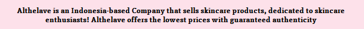

<h1 align="center">
<br>
Althelave - Skincare UI Design
<br>
Desktop Application
</h1>

## Description
This is a Desktop Application, created using Java GUI. The main function itself is to display skincare informations and products.

## Features
There are several functions in this application:
- Automatic Carousel -> just like Instagram Story (top right).
- Manual Carousel -> to view Hot Items (at the bottom, before About Us section).
- Scroll Pane -> to view informations about the application, there are hover effect when any of the information is hovered (middle left).
- A couple Menus -> with hover effect:
  * Brands -> to view existing brands in the application, user may user mnemonic & accelerator to open any menu item for faster experience. when redirected to any brand page, there are hover effect when any product is hovered. every brand page has a 'back' button.
  * Skincare Guide for Beginner -> redirect to a youtube video.
- About us -> "About Us" text changes when hovered.


## Screenshots

<div style="display: inline-block; vertical-align: middle;">
  
  <p>Home</p>
 
  <br/>
  
  
  <p>Automatic Carousel</p>
 
  <br/>
  
  <p>
  <p>Manual Carousel</p>
  
  <br/>
 
  
  <br/>
  
  <p>Scroll Pane</p>
  
  <br/>
  
  
  <br/>
  
  <p>Menus</p>
  
  <br/>
  
  
  <br/>
  
  <p>Brands</p>
  
  <br/>
  
  
  <p>Skincare Guide</p>
  
  <br/>
  
  
  <br/>
  
  <p>About Us</p>
</div>

## License

All the code available under the MIT license. See [LICENSE](LICENSE).

```
MIT License

Copyright (c) 2019 Marcos Paulo Farias

Permission is hereby granted, free of charge, to any person obtaining a copy
of this software and associated documentation files (the "Software"), to deal
in the Software without restriction, including without limitation the rights
to use, copy, modify, merge, publish, distribute, sublicense, and/or sell
copies of the Software, and to permit persons to whom the Software is
furnished to do so, subject to the following conditions:

The above copyright notice and this permission notice shall be included in all
copies or substantial portions of the Software.

THE SOFTWARE IS PROVIDED "AS IS", WITHOUT WARRANTY OF ANY KIND, EXPRESS OR
IMPLIED, INCLUDING BUT NOT LIMITED TO THE WARRANTIES OF MERCHANTABILITY,
FITNESS FOR A PARTICULAR PURPOSE AND NONINFRINGEMENT. IN NO EVENT SHALL THE
AUTHORS OR COPYRIGHT HOLDERS BE LIABLE FOR ANY CLAIM, DAMAGES OR OTHER
LIABILITY, WHETHER IN AN ACTION OF CONTRACT, TORT OR OTHERWISE, ARISING FROM,
OUT OF OR IN CONNECTION WITH THE SOFTWARE OR THE USE OR OTHER DEALINGS IN THE
SOFTWARE.
```
